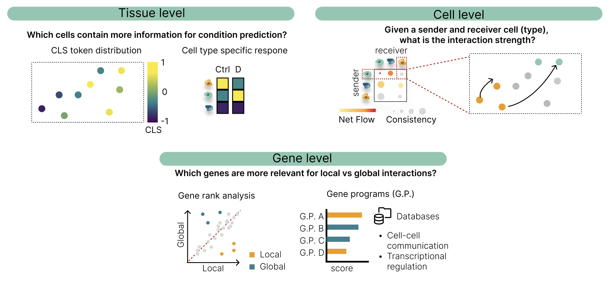

# Tools

InterScale tools provides utilities for analyzing and interpreting 1) local and global embeddings and 2) attention matrix.

Downstream InterScale's output can be used for gene, cell and tissue level analysis.



## Tissue level

```{eval-rst}
.. module:: interscale.evaluation
    :no-index:
.. currentmodule:: interscale.evaluation

.. autosummary::
    :nosignatures:
    :toctree: generated

    scale_cls_by_sample
```

## Cell level

```{eval-rst}
.. currentmodule:: interscale.evaluation

.. autosummary::
    :nosignatures:
    :toctree: generated

    plot_all_spatial_net_streams
    plot_flow_clusters
```

## Gene level

```{eval-rst}
.. currentmodule:: interscale.evaluation

.. autosummary::
    :nosignatures:
    :toctree: generated

    gene_loadings
    calculate_gene_ranks
```

## Anchors and distance zones

Where a latent dimension anchors on a slide, and how expression behaves at range from there.
The distance axis is the point: the local component reaches at most
{func}`~interscale.tl.local_reach_um` micrometres, so structure beyond that abscissa cannot
have come from it.

```{eval-rst}
.. currentmodule:: interscale.tl

.. autosummary::
    :nosignatures:
    :toctree: generated

    local_reach_um
    find_anchor_cells
    anchor_signed_distance
    anchor_zones
    profile_by_distance
    anchor_enrichment
```

```{eval-rst}
.. currentmodule:: interscale.pl

.. autosummary::
    :nosignatures:
    :toctree: generated

    anchor_map
    signed_distance_map
    zone_map
    gene_maps
    distance_profile
```
