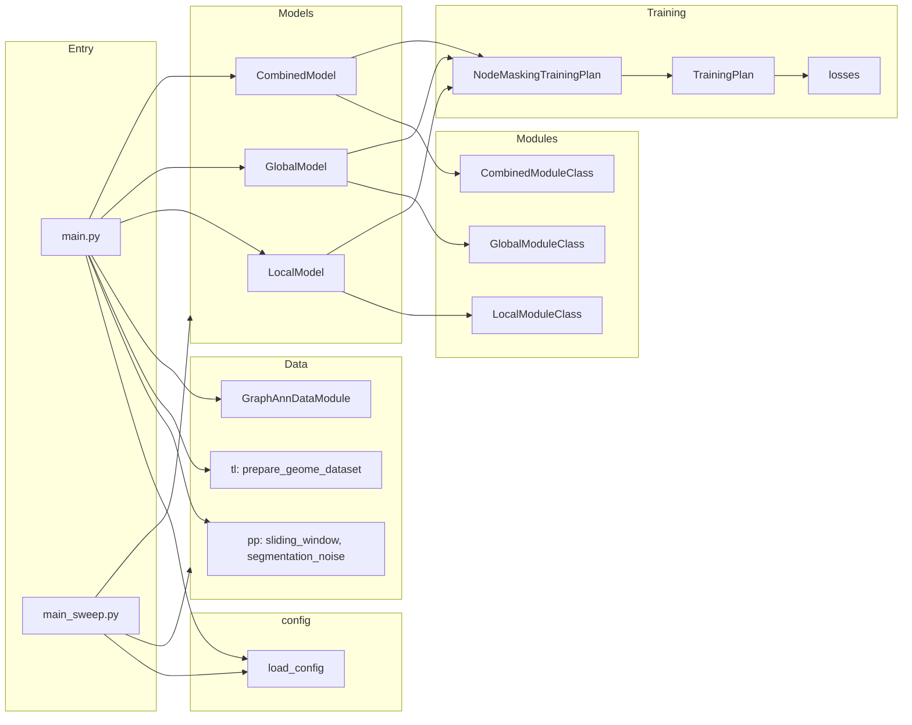

# InterScale `src/` Folder Summary

The `src/` directory contains the InterScale model codebase: configuration loading, data prep, model and module definitions, training, and evaluation. Entry points are at the top level; the main package lives under `InterScale/`.

## Top-Level Layout

| Path | Description |
|------|-------------|
| `InterScale/` | Main Python package (config, model, module, nn, pp, tl, train, evaluation) |
| `config_files/` | YAML config examples and a short readme for `config.yaml` |

**Root-level modules:**

- **[main.py](InterScale/main.py)** – CLI entry: loads config, reads h5ad, optionally applies segmentation noise, builds `LocalModel` / `GlobalModel` / `CombinedModel`, prepares data via `prepare_geome_dataset`, trains with `GraphAnnDataModule`.
- **[main_sweep.py](InterScale/main_sweep.py)** – WandB sweep entry: same pipeline as `main.py` but driven by sweep config; includes memory logging.
- **[geome_dataloader.py](InterScale/geome_dataloader.py)** – `GraphAnnDataModule`: Lightning DataModule for graph (PyG) data; supports node- and graph-level learning, spatial node loader, and node masking.
- **[_paths.py](InterScale/_paths.py)** – Project path constants (e.g. cluster roots, default config/data dirs, named dataset paths like `HE22_HUMAN_LUNG_DATA_PATH`, `COSMX_PANCREAS`).

---

## 1. `InterScale/config/` – Configuration Loading

Loads and merges all settings (YACS `CfgNode`). Used by `main.py` and `main_sweep.py`.

- **[__init__.py](InterScale/config/__init__.py)** – `get_cfg_defaults()` builds default cfg from all sub-configs; `load_config(cfg_path)` loads defaults, then (if path given) local/global component configs by model type, then merges the YAML file and freezes.
- **model_config.py** – Model: `n_embed`, local/global component names, decoder type (linear / nonlinear / linear-lse), hidden dims, dropout, `dual_decoder`.
- **dataset_config.py** – Dataset: h5ad path, prediction task/obs/layer, sample keys, spatial neighbor kwargs, batch/train/val/test sizes, stratification, `pct_mask_nodes`, segmentation robustness.
- **optim_config.py** – Optim: accelerator, lr, lr_scheduler (e.g. CosineWarmupScheduler), warmup, weight decay, loss (e.g. GaussianNLL, BalancedPearsonCorrelationLoss), seed, `cross_corr`, n_epochs, early_stopping.
- **wandb_config.py** – WandB: `use`, `project_name`.
- **local_component_config.py** – Per–local-component defaults (GCN, GIN, SCVI, Precomputed): hidden_dim, num_layers, dropout_local.
- **global_component_config.py** – Per–global-component defaults (e.g. self-attn-transformer): n_heads, dim_feedforward, dropout_global, activation, num_layers, max_seq_len, long_range_attention, type_gex_embedding, latent_obsm_key.

---

## 2. `InterScale/model/` – Model Structures

High-level models that wrap modules and use the SCVI-style base (AnnData setup, training plan, saving).

- **[base/_base_model.py](InterScale/model/base/_base_model.py)** – `BaseModelClass` (and metaclass): AnnData manager setup, `_setup_anndata`, init from config, training interface; defines save keys and model summary.
- **[LocalModel.py](InterScale/model/LocalModel.py)** – Local-only model: uses `LocalModuleClass.from_config` (e.g. GCN), `NodeMaskingTrainingPlan`; `get_model_output` writes local embeddings and predictions to adata.
- **[GlobalModel.py](InterScale/model/GlobalModel.py)** – Global-only model: uses `GlobalModuleClass.from_config` (e.g. transformer), GEX embedding (PCA/NMF/Precomputed); `get_model_output` writes global embeddings and attention.
- **[CombinedModel.py](InterScale/model/CombinedModel.py)** – Local + global: builds either `CombinedModuleClass` or `DualDecoderCombinedModuleClass` from config; `get_model_output` writes local/global embeddings, predictions, and attention.

---

## 3. `InterScale/module/` – Trainable Modules (Local, Global, Combined)

PyTorch Lightning modules that implement the actual forward pass and losses. Used by the model classes above.

- **base/** – Abstract bases:
  - **_base_module.py** – `BaseModuleClass`: common init (n_input, n_output, n_embed, decoder type, masking), decoder selection, `_common_step` interface.
  - **_base_local_module.py** – `LocalModuleClass`: local-only; `forward(x, edge_index)`, `predict` with decoder.
  - **_base_global_module.py** – `GlobalModuleClass`: global-only; GEX embedding (PCA/NMF/Precomputed), `forward(embeddings)`, padding/masking for sequences.
- **local_modules/** – Concretes: GCN, GIN, SCVILocalModule, PrecomputedEmbeddingModule (see `local_modules/__init__.py`). Used for graph-level local encoding.
- **global_modules/** – `TransformerNodeEncoderHook`: transformer over node sequence; used as global context encoder.
- **combined_module/** – Combines local + global:
  - **combined_module.py** – `CombinedModuleClass`: one local module (no decoder) + one global module (with decoder); forward: local then global on local embeddings.
  - **dual_decoder_combined_module.py** – `DualDecoderCombinedModuleClass`: local and global each have a decoder; dual prediction path.

---

## 4. `InterScale/nn/` – Decoder Building Blocks

- **[_base_components.py](InterScale/nn/_base_components.py)** – `LinearDecoder`, `NonLinearDecoder` (MLP), `LinearLSEDecoder` (log-sum-exp). Used by the base module to map embeddings to prediction targets.

---

## 5. `InterScale/pp/` – Preprocessing and Data Prep

- **basic.py** – `compute_neighborhood_stats`: neighborhood stats for multiple radii (Squidpy).
- **spatial_data.py** – `sliding_window`: split tissue into spatial windows (optionally with overlap, max cells, merge/drop partial).
- **segmentation_noise.py** – `apply_segmentation_noise`: simulate segmentation errors by redistributing expression to neighbors (node_fraction, overflow_fraction).

---

## 6. `InterScale/tl/` – Data Loading, Masking, and Training Utilities

- **geome_utils.py** – `prepare_geome_dataset(adata, cfg)`: builds PyG data lists from adata and cfg (splits, layers, prediction task). `prepare_a2d_dataset(cfg)`: returns geome `Ann2DataBasic` for iteration (fields, edge index, preprocess).
- **padding.py** – `pad_batch`: pad variable-length sequences for transformer.
- **masking.py** – `apply_mask`: mask nodes in PyG batch; `create_transformer_attention_mask_from_edges`, `attn_mask_diagonal`: attention masks from graph structure.
- **scheduler.py** – `CosineWarmupScheduler` for LR.
- **utils.py** – `check_and_update_cfg`, `set_full_reproducibility`, `get_model_filename_prefix`.
- **self_attn_relevance.py** – `SelfAttentionRelevance`: hook to extract attention weights.
- **_preprocessing.py** – `remove_zero_expression_cells`.
- **patient_split.py** – `split_adata_patient_stratified`.
- **clustering.py** – (tl-level clustering utilities if any; distinct from evaluation clustering.)

---

## 7. `InterScale/train/` – Training Plans and Losses

- **_training.py** – `NodeMaskingTrainingPlan`: high-level train loop (max_epochs, datamodule, early stopping); wraps a `TrainingPlan` and Trainer/checkpointing.
- **_trainingplans.py** – `TrainingPlan`: Lightning module that holds the actual module, sets optimizer, lr scheduler (CosineWarmupScheduler / ReduceLROnPlateau), train/val/test steps, and metrics (classification vs regression losses).
- **losses.py** – `BalancedPearsonCorrelationLoss` (gene/cell balancing), plus GaussianNLL, SCE, etc. used in training plans.
- **wandb_workspace.py** – WandB helpers for runs/sweeps.

---

## 8. `InterScale/evaluation/` – Evaluating Model Outputs

- **_gene_loadings.py** – `gene_loadings`: extract/analyze decoder loadings (e.g. for interpretation).
- **_gene_set_covariance.py** – `gene_set_covariance`, `spatial_covariance_plot`: variance/covariance per gene set and embedding dimension; optional elbow plots.
- **clustering.py** – `leiden_cluster_embeddings`: Leiden on local/global embeddings with multiple seeds; `plot_clustering_metrics`: ARI/AMI/NMI across seeds.
- **gene_rank_analysis.py** – `predict_gene_r2`: per-gene R² between prediction layer and true expression; ranking and optional plots.
- **graph_classification.py** – `calculate_pr_auc`, `pr_auc_curve`, `scale_cls_by_sample`: scale CLS tokens per sample; PR/AUC for graph-level classification.

---

## 9. `config_files/`

- **config_read_me.md** – Short guide: `cfg.model` (including precomputed embeddings and `n_embed` / `n_heads` divisibility).
- **InterScale_example.yaml** – Example YAML config.
- Other YAMLs (e.g. checkpoint/he23_lung, etc.) – Dataset- or experiment-specific configs.

---

## Data and Control Flow (High Level)

---

## File Count Summary

- **InterScale:** config (7), model (4 + base), module (base + local + global + combined), nn (1), pp (3), tl (9), train (4), evaluation (5), plus root `__init__.py`, main, main_sweep, geome_dataloader, _paths.
- **config_files:** readme + YAML configs (exact count from glob: 3+ YAML files).
